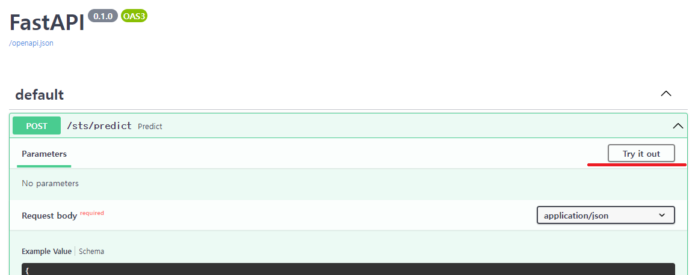

# 원티드 프리온보딩 텍스트 유사도 API server

2개의 한글 문장을 입력받아 문장간의 유사도를 예측하는 API입니다. 사용한 사전학습 모델은 [KR-BERT_character_sub-character](https://github.com/snunlp/KR-BERT) 입니다.

입력: 문장 2개  
```console  
{
"sentence1": "숙소 위치는 찾기 쉽고 일반적인 한국의 반지하 숙소입니다.",  
"sentence2": "숙박시설의 위치는 쉽게 찾을 수 있고 한국의 대표적인 반지하 숙박시설입니다."
}
```

반환값: 유사도 예측 결과  
```console 
{
"label": 3.9,  
"real label": 3.917365074157715,  
"binary label": 1
}
```

<br>
<br>

## 1. 폴더 구조
```
.
├── README.md
├── app
│   ├── basemodels.py
│   ├── neuralnet.py
│   ├── router
│   │   └── predict.py
│   ├── torch_models
│   │   ├── torch_model.pt
│   │   └── vocab_snu_subchar12367.txt
│   └── utils.py
├── download_model.py
├── main.py
└── requirements.txt
```

<br>
<br>

## 2. 실행방법

직접 설치하는 방법과 도커 이미지를 사용하는 방법 2가지를 제공합니다.

### 직접 설치하기

1. 다운로드 프로젝트
```console
$ git clone https://github.com/preonboarding-team4/STS_APIserver.git
$ cd STS_APIserver
```

2. 필요한 패키지 설치
```console
$ pip install -r requirements.txt
```

3. 모델 가중치 파일 다운로드
```console
$ python download_model.py
```

4. API서버 실행
```console
$ python main.py
```

<br>

### 도커 사용하기

```console
docker run -d --name <컨테이너 이름> -p <사용할 포트번호>:8000 hl8469/preonboarding:api-1.0.0
```

<br>
<br>

## 3. API 호출방법
아래와 같은 방법으로 호출할 수 있습니다.


### 1. curl
```console
curl -X 'POST' \
  'http://<호스트 주소>:<호스트 포트번호>/sts/predict' \
  -H 'accept: application/json' \
  -H 'Content-Type: application/json' \
  -d '{
  "sentence1": "비교할 문장1",
  "sentence2": "비교할 문장2"
}'
```

<br>

### 2. swagger


1. 서버 접속  

```console
http://<호스트 주소>:<호스트 포트번호>/docs
```

<br>

2. Try it out 클릭



<br>

3. 문장 입력 및 Execute


<br>

4. 아래에서 호출결과 확인


